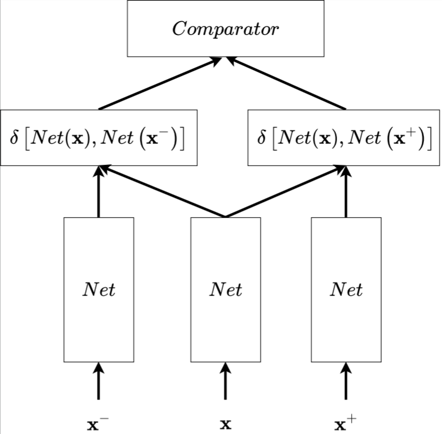
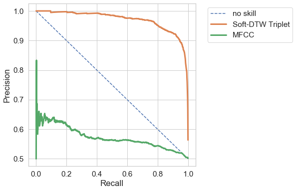

# Soft-DTW-AWE
 
This repository implements the embedding model trained to solve the 
word discrimination task.
In the word discrimination task, the model receives two audio signals
 of spoken speech as input and has to decide whether these two signals 
 are the same or different words.

## How it works

To decide whether two audio siganls represent the same word, 
one can compute distance between them. If the distance is lower than
a specified threshold, then decide that these signals belong 
to the same word. If the distance is higher than the threshold,
 then these are different words.
 
 ### How distance is calculated
 To compute the distance, apply Dynamic Time Warping (DTW) algorithm,
 which finds an optimal mapping between two signals. 
 [This article](https://towardsdatascience.com/dynamic-time-warping-3933f25fcdd)
 gives an easy to digest explanation of how DTW works and where it
  can be used. 
  
 However, applying DTW directly to audios has shown poor performance.
 Same applies to classical representations of speech audio such as MFCCs.
 A solution can be to train an embedding model and use embeddings of 
 audios with DTW algorithm.
 
 ### Embedding model overview
Network presented here is a variation of 
 [triplet network](https://arxiv.org/abs/1412.6622).
 
 
  
When fed with 3 samples, the network outputs 2 intermediate values -
the distances between the embedded representation of two of its
inputs from the representation of the third. 

Training is performed with the triplet loss

 $$\mathcal{L}(\mathbf{x}, \mathbf{x}^+, \mathbf{x}^-)=\max(\delta\left[Net(\mathbf{x}),Net\left(\mathbf{x}^{+}\right)\right] - {}
        \delta\left[Net(\mathbf{x}), Net\left(\mathbf{x}^{-}\right)\right] + \alpha, 0)$$

Minimizing this loss ensures that distance between
samples of different classes is greater (and bigger than the margin $a$)
than the distance between samples of the same class. 

A differentiable [Soft-DTW](https://arxiv.org/abs/1703.01541) is used as a distance metric in the loss function. Training the network using the Soft-DTW makes perfect sense since , after training, embeddings are going to be compared with DTW algorithm. In other words, the model is optimized in a way it is going to be used.

### Resulting performance
[SpeechCommands](https://ai.googleblog.com/2017/08/launching-speech-commands-dataset.html)
 dataset was used to train and evaluate performance of the embedding model. 

 

 Precision-Recall curve of the trained model is denoted as **Soft-DTW Triplet**. For the comparison precision-recall of the model operating using **MFCC** is hown on the same graph. 

 Average Precision (AP) of **Soft-DTW Triplet** is 0.97, while **MFCC** reaches only 0.57. 

 For details these and more results, readers are encouraged to have a look at the [notebook](Learned_embeddings_distance_distribution.ipynb)

 ## Pretrained models
 pretrained models with the corresponding configuration used for the training can be found [here](saved_models/)

 ## Dataset
[SpeechCommands](https://ai.googleblog.com/2017/08/launching-speech-commands-dataset.html)
 dataset was used to train and evaluate performance of the embedding model. 

 ## Training
 To train an embedding model youself, run:

 `python train.py <path to the config file>`

To reproduce results, you may want to use this [config file](saved_models/config.yaml). Before using, make sure you changed the `data_root` field in the config to the actual location of the dataset. 